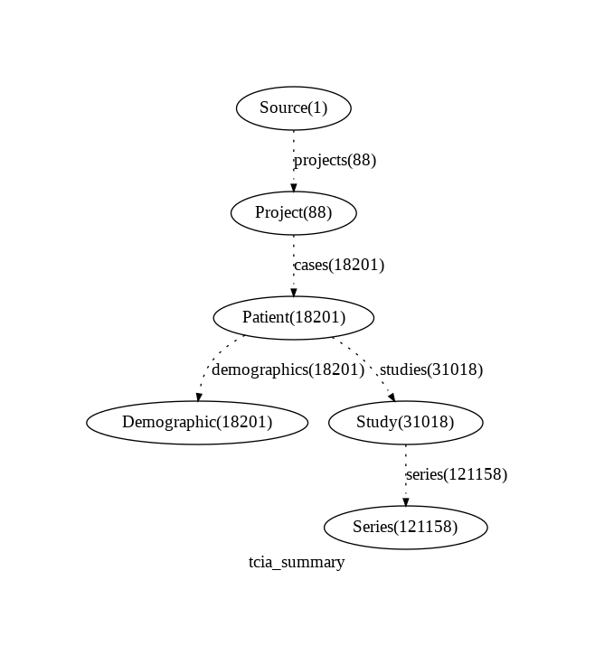
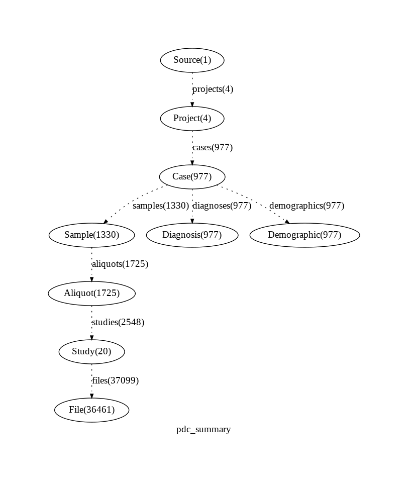
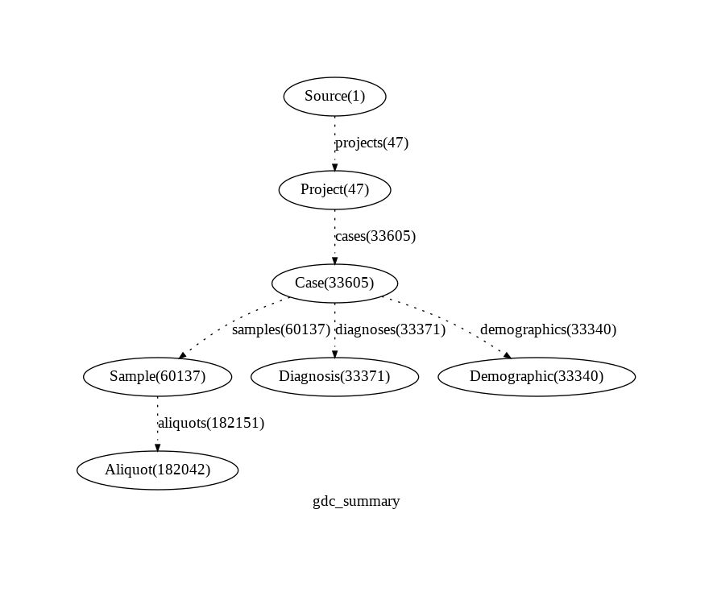
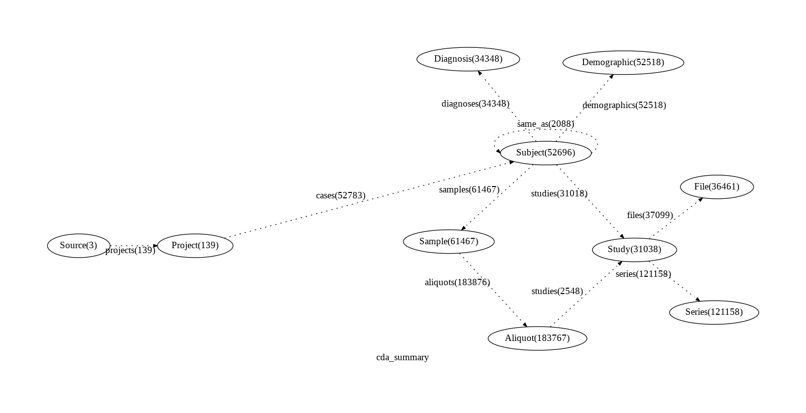
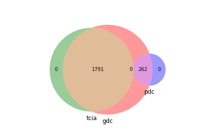
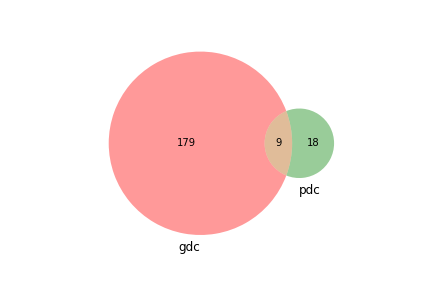

# Overview

Method:

* We downloaded the 3 target datasets, creating a simple graph from each
* Apply simple transform to harmonize [Patient, Case] to 'Subject'
* Introspect the Subject nodes, identifying the 'same_as' edge
* Illustrate the diagnosis vocabulary 

## TCIA

## PDC

## GDC

## Composed CDA 

## Shared cases distribution
* gdc 2053
* tcia 1791
* pdc 262

## Diagnoses

* diagnoses in pdc & gdc 9
* diagnoses in pdc not found in gdc 18
* diagnoses in gdc not found in pdc 179
* note: no diagnoses in tcia

